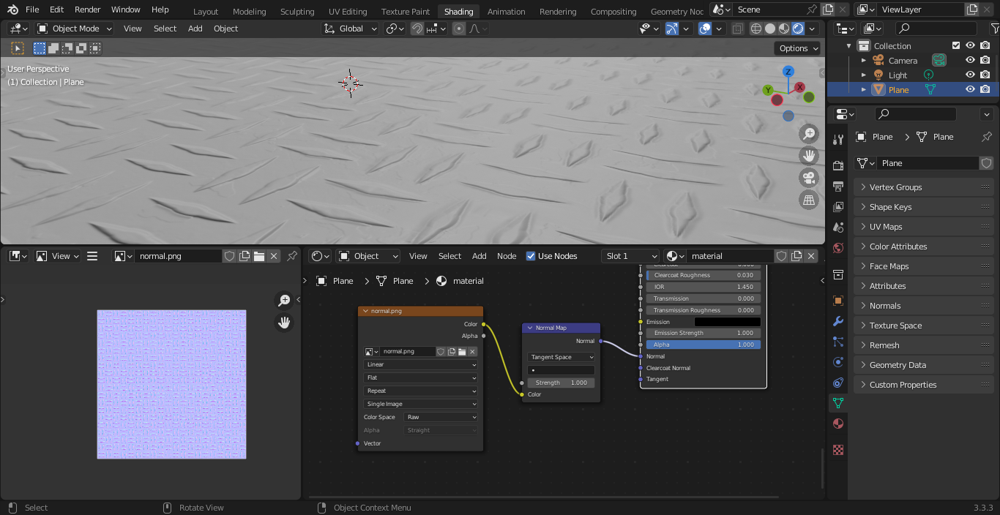
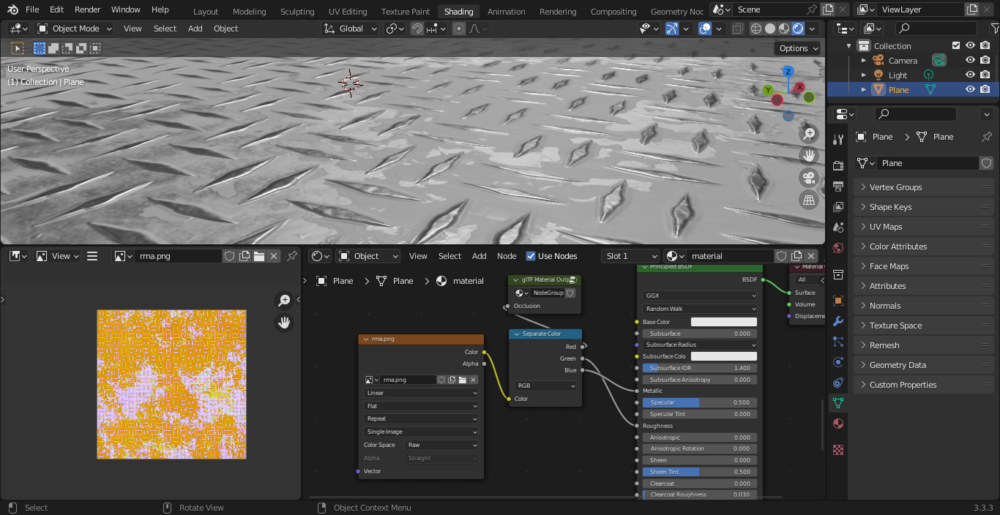
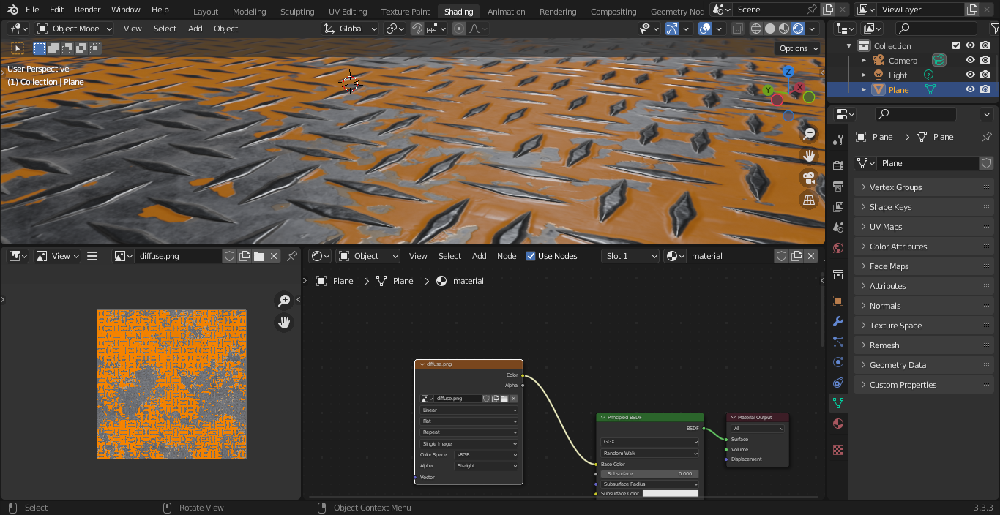

# Blender to Three.js materials

How to properly configure a material in blender, which will be then exported to gltf and imported back into a three.js viewer.

I choose [this set of textures](https://ambientcg.com/view?id=DiamondPlate006C).

## Normal

## Roughness & Metallic

These should be stored within the same texture.
- Roughness in the green channel
- Metallic in the blue channel

[Here's](../EditRGBChannelsInKrita/EditRgbChannelsInKrita.md) how you can do it in Krita.

## Baked lighting

Baked lighting &/or ambient occlusion must be connected to a special custom node to be stored within the gltf file as the ambient occlusion map.  
It's explained [here](https://docs.blender.org/manual/en/latest/addons/import_export/scene_gltf2.html#baked-ambient-occlusion)

## Diffuse

## Uvs

If you don't create uvs in the right order, i.e. the base uv for diffuse, roughness & metallic and then the uv for the lightmap, they will appears with the wrong index in the gltf file, and three.js won't use them well, throwing a warning at the same time.  

If it happened, and you don't want to recalculate all of your uvs, there is apparently some [add-on](https://blender.stackexchange.com/questions/67266/changing-order-of-uv-maps) to reorder them, but I wasn't able to make it work on 3.3.