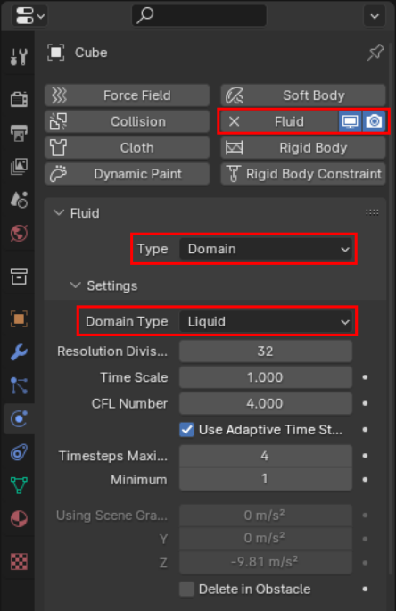

# CSS Mask transition effect with Blender

This idea is to create an animated transition between two layers. The top one disolve itself to reveal the underlying one.

To achieve this, we'll bake a fluid simulation into a spritesheet, which will then be used as an animated css mask.

## Fluid simulation in blender

### The domain

The domain will contain, tweak, and bake our simulation.

Create a cube. \
Under **Physics** properties menu :

- Choose **Fluid**.
- Set **Type** to **Domain**.
- Set **Domain Type** to **Liquid**.

Here's are an example of a configurations that should make the fuild to completelly cover our plane under 25 frames.

- Set sampling to **3**.
- Activate **Viscosity**, and set it to **0.002**.
- Activate the **Mesh** menu further down, which willl make our fluid act as a polygonal mesh, enabling us to compute ambiant occlusion later.

Under **Cache**:

- set **Frame end** to **25**.
- set **Type** to **All**, the simulation will be baked.

### The flow

The flow will emit our fluid.

Create a sphere, scale it down and place it inside the cube.

Under **Physics** properties menu :

- Choose **Fluid**.
- Set **Type** to **Flow**.
- Set **Flow Type** to **Liquid**.
- Set **Flow Behavior** to **Inflow**, we want the sphere to continuously emit a fluid.
- Toggle **Initial Velocity**, and set **Initial Z** to **-10**, the fluid will be propulsed downward.

### The effector

The effector will interact with our fluid. It is on this object that we will bake our animated mask.

Create a plane, put it at the bottom of the cube.

Under **Physics** properties menu :

- Choose **Fluid**.
- Set **Type** to **Effector**.
- Set **Surface Thickness** to **1.0**, otherwise the fluid will pass through.

### Runing the simulation

Now everything is in place to bake the simulation. \
Make sure you select the domain cube, and within the **Physics Property** panel, under the **Cache** sub-menu, you'll find the **Bake All** button.

Once you click on it, it will run for a while, and you should see the animated fluid once its done.

## Rendering fluid footprint

To export the images of the fluid footprint in black & white, we can render on camera the ambiant occlusion calculated on our effector plane.

### Camera

Select the camera, or create a new one. \
Under **Ouput Properties** panel :

- Set **Format** to a square definition, like **512x512**.
- Set **Frame Range** from 0 to 25.
- Set your **Output** folder location.

We need to focus the camera on our plane. \
Place the camera on top of the plane, facing down.

Then, by changing to **camera view** by pressing the **0 key**, adjust its z position to enclose most of the plane.

### World material
