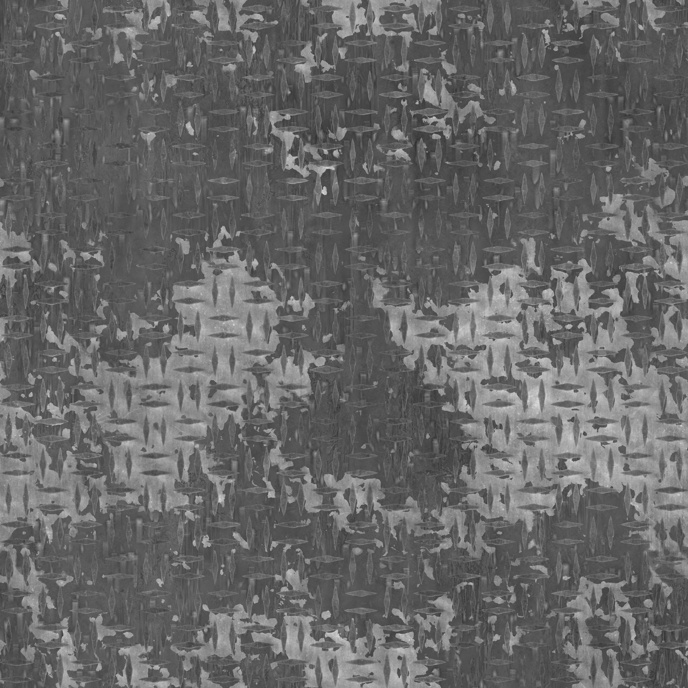
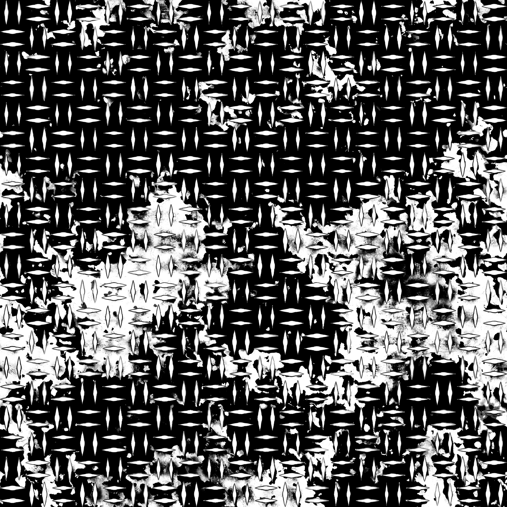
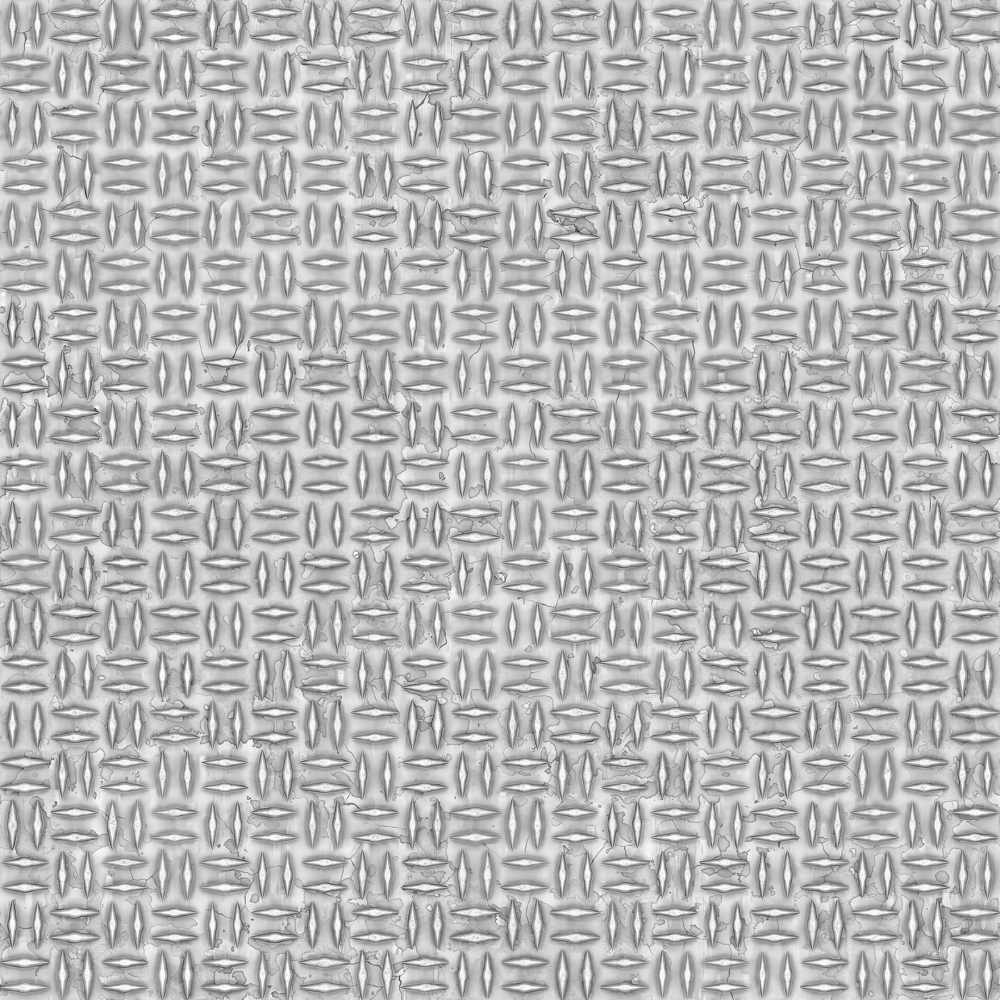
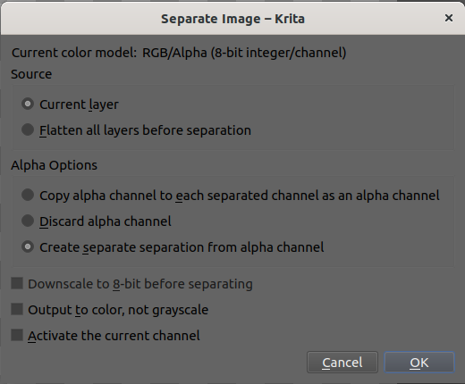
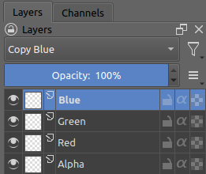
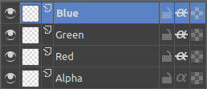

---
blender-version: 3.3
---

# Store roughness, metallic & ambient occlusion in the same texture

So you have let's say three greyscale textures, representing roughness, metallic and ambient occlusion, and you want to store then in a single image, each original image in a different rgb channel.

## With Krita

### Set up the layers

Krita's documentation makes it clear that channels cannot be edited directly, but gives [instructions to achieve a similar result](https://docs.krita.org/en/reference_manual/dockers/channels_docker.html#editing-channels).

It looks kind of like this :

Create a new document.  

Keep only the *Background* layer, unlock it & select it.

Go to *Image > Separate Image*, leave options as it is and press *ok*.  
You can then delete the *Background* layer.

Select the *Blue* layer, Change its *Blending Mode* to *Copy Blue*, do the same for *Green* and *Red*, respectively to *Copy Green* and *Copy Red*.  
These blending mode are found under the *Misc* subfolder. Make sure you select the name and not the checkbox next to it. By ticking the checkbox though, the blending mode will be made available from the top of the list as a favorite.

Enable alpha inheritance on all three channels.

### Copy the originals textures

Now you can import the originals textures in different files one by one.  
For each one, select the whole image with *crtl-a*, copy it with *ctrl-c*, and past it to the corresponding channel layer.
You can do so by selecting the corresponding layer and going to *Edit > Paste into active layer*.

If you don't have data to fill a channel, paint it fully black or white depending on your default value.

Once it's done for all three channels, make sure the alpha channel is pure white.

You should now have a single texture combining multiple information.

## With Gimp

It should be something like [this](https://www.youtube.com/watch?v=BOZv-A_6iFk).  
However, I wasn't able to make it work, and according to the comments bellow the video I'm not alone.
