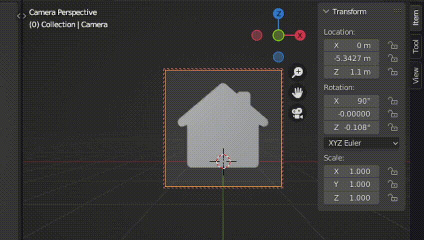
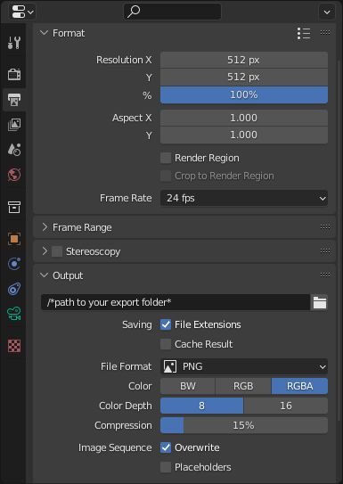
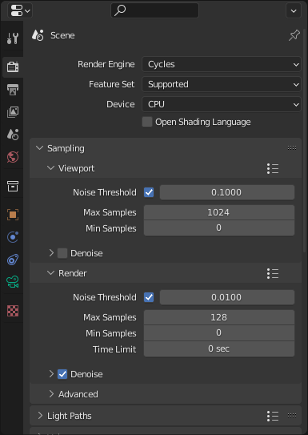
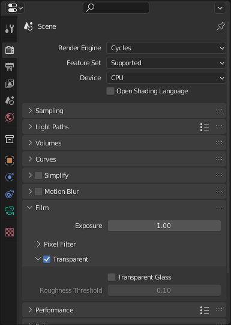
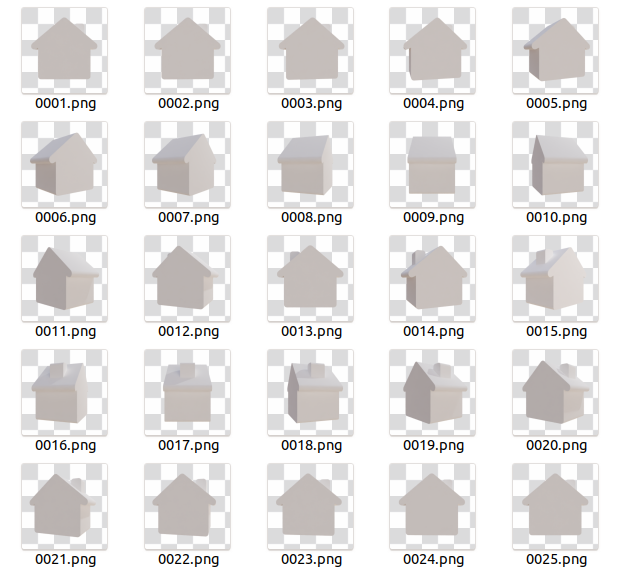
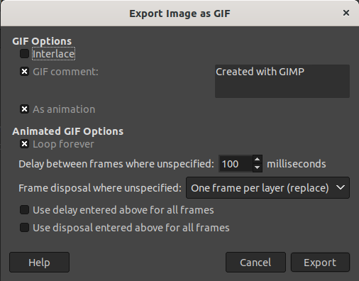
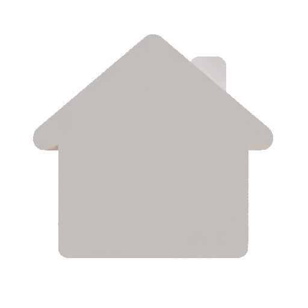

# Blender animation to .gif

So you have an animation that needs to be exported to a .gif.

## Export the images

Under *Output properties > Format*, choose the right resolution for your camera and output images.  
Under *Output Properties > Output*, specify your output folder, choose *PNG* file format and RGBA if you intend to keep a transparent background.

Choose your render engine and set a correct render sampling. For a small .gif, cycle with only 16 sample was enough.

If you don't want the background to appear in the images, you can check *Render Properties > Film > Transparent* to have a transparent background.

Hit ctrl+f12 to render the animation.

You shoud now have a set of images.

## Combine the images into a .gif

### With Gimp

Create a new file with the resolution of your output images.  
Remove the background layer.  
Go to *File > Open as layers...* (Ctrl+Alt+O), and open all of your output images at once.  
Go to *File > Export As...* (Shift+Ctrl+E), and name your file with a .gif extension.

From the .gif configuration window, make sure that :
- *As animation* is on
- *Frame disposal where unspecified* is set to *One frame per layer (replace)*

Hit *Export*.

