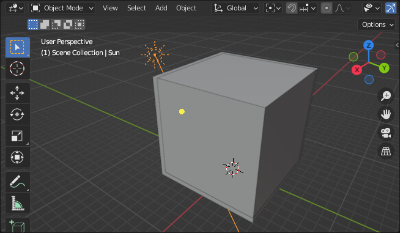

# Lighting Baking In Blender

## The ingredients

Start with a three walls room, and a hole in one of them as a window.  
Unwrap its uv :  
- Select the room
- Switch to edit mode
- Select all the geometry (*a*)
- Generate uvs (*u > Lightmap Pack*)

Add a sun which will be our only source of light.  
Set the sun [strength](https://docs.blender.org/manual/en/latest/render/lights/light_object.html#sun-light) to 1000.  
Makes its ray pass through your window.

Add three planes to close the room, and hide them from camera :  
Untick  *Object properties > Visibility > Ray Visibilty > Camera*

## Pre-heat your hoven

You have to setup a few things before baking :
 - Use cycle render engine.  
 - To test it first, set the *Render Properties > Sampling > Render > Max Samples* to a low count, like 8, and then if the baking succeded, try a higher one, like 1024.
 - Toggle off *Render Properties > Sampling > Render > Denoise* otherwise it will add artifact along the uv seams. You will have to denoise the image afterward, more on that later.
 - Make sure your normals are oriented outside. I had to throw a few cakes out cause of ill oriented normals.  

Create a lightmap texture :
- Select the room
- In shader editor add an *Image Texture* node
- Create a new texture within this node

## Bake

Make sure you selected the *Image texture* node you just created.  
Click the *Render properties > Bake > Bake* button.  
Wait until every corner of the image have been properly cooked, time might depends on the hoven.

## Taste it

Create a new material, and connect a *Image Texture* node directly to the shader output, with our baked texture.

Enjoy your baked lighting.